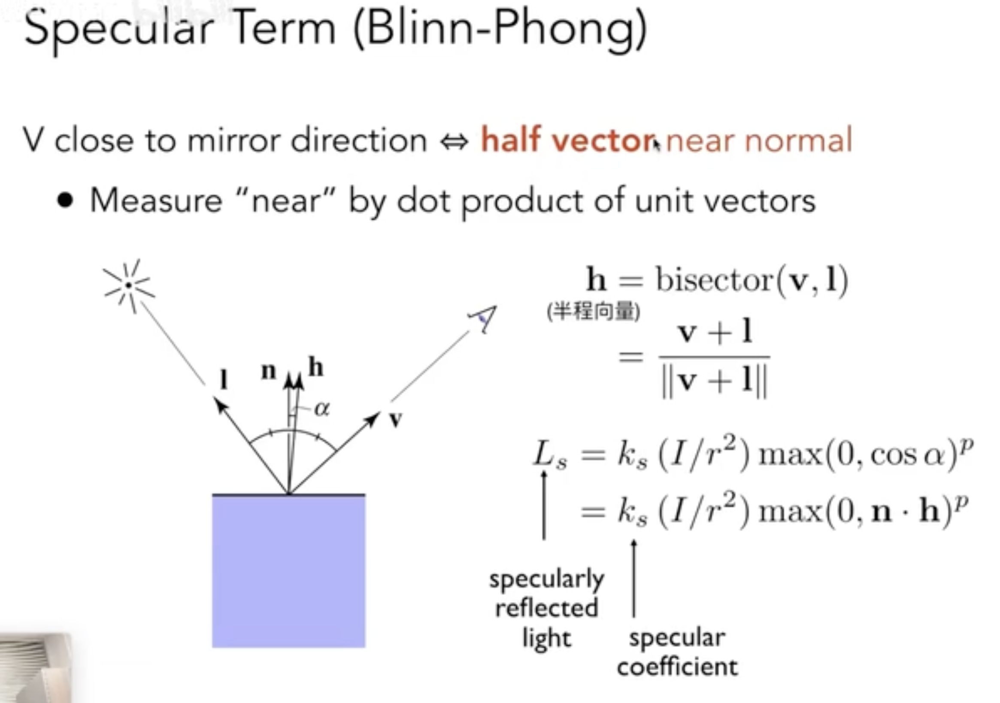
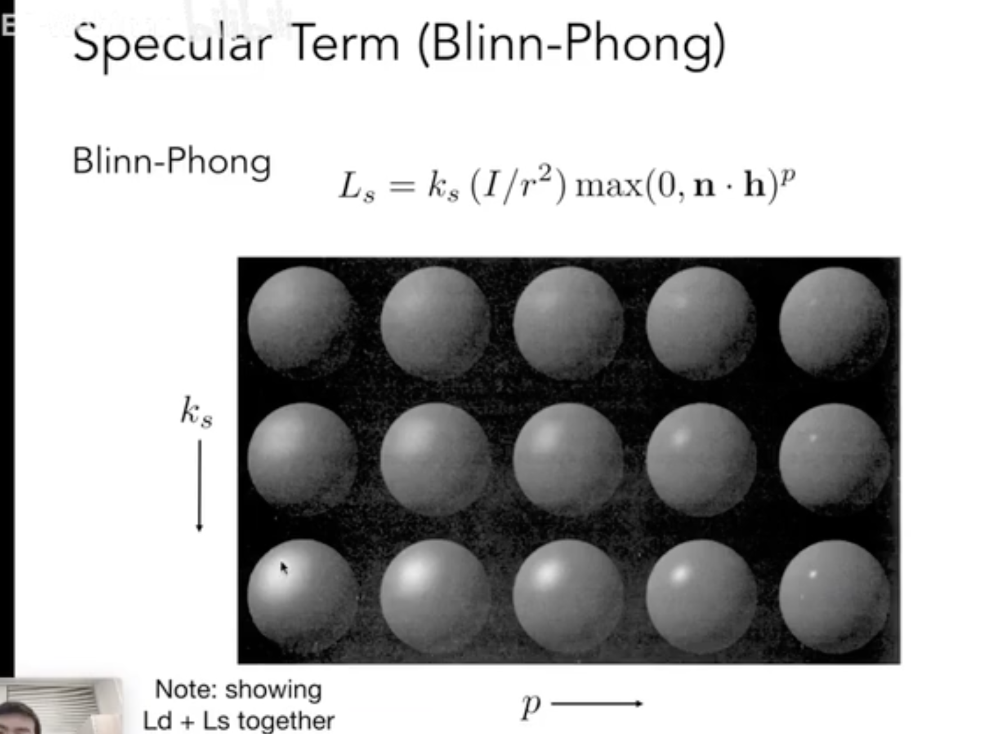

# Lambert Diffuse

# 高光反射

# 环境光

![环境光]

# 渲染管线

1. Application Input：输入数据
2. Vertex Processing：定点处理
3. Rasterization：光栅化
4. Fragment Processing：片源处理
5. Framebuffer Operation：像素化 

# 纹理映射

定义一个点与点之间的表现