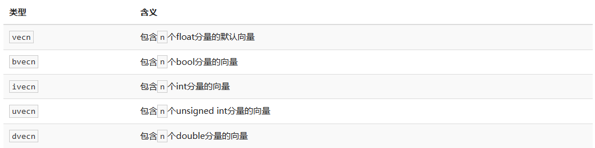

# 着色器

[上一节](/mds/Mine/Render/OpenGL/MyParticles/03_First_Trianggle.md)中提到，着色器(Shader)是运行在GPU上的小程序。这些小程序为图形渲染管线的某个特定部分而运行。从基本意义上来说，着色器只是一种把输入转化为输出的程序。着色器也是一种非常独立的程序，因为它们之间不能相互通信；它们之间唯一的沟通只有通过输入和输出。

前面的教程里我们简要地触及了一点着色器的皮毛，并了解了如何恰当地使用它们。现在我们会用一种更加广泛的形式详细解释着色器，特别是OpenGL着色器语言(GLSL)。

# GLSL

着色器是使用一种叫GLSL的类C语言写成的。GLSL是为图形计算量身定制的，它包含一些针对向量和矩阵操作的有用特性。

着色器的开头总是要声明版本，接着是输入和输出变量、uniform和main函数。每个着色器的入口点都是main函数，在这个函数中我们处理所有的输入变量，并将结果输出到输出变量中。如果你不知道什么是uniform也不用担心，我们后面会进行讲解。

一个典型的着色器有下面的结构：

```GLSL
#version version_number
in type in_variable_name;
in type in_variable_name;

out type out_variable_name;

uniform type uniform_name;

int main()
{
  // 处理输入并进行一些图形操作
  ...
  // 输出处理过的结果到输出变量
  out_variable_name = weird_stuff_we_processed;
}
```

当我们特别谈论到顶点着色器的时候，每个输入变量也叫顶点属性(Vertex Attribute)。我们能声明的顶点属性是有上限的，它一般由硬件来决定。OpenGL确保至少有16个包含4分量的顶点属性可用，但是有些硬件或许允许更多的顶点属性，你可以查询GL_MAX_VERTEX_ATTRIBS来获取具体的上限：

```C++
int nrAttributes;
glGetIntegerv(GL_MAX_VERTEX_ATTRIBS, &nrAttributes);
std::cout << "Maximum nr of vertex attributes supported: " << nrAttributes << std::endl;
```

通常情况下它至少会返回16个，大部分情况下是够用了。

# 数据类型

和其他编程语言一样，GLSL有数据类型可以来指定变量的种类。GLSL中包含C等其它语言大部分的默认基础数据类型：int、float、double、uint和bool。GLSL也有两种容器类型，它们会在这个教程中使用很多，分别是向量(Vector)和矩阵(Matrix)。

## 向量

GLSL中的向量是一个可以包含有2、3或者4个分量的容器，分量的类型可以是前面默认基础类型的任意一个。它们可以是下面的形式（n代表分量的数量）



大多数时候我们使用vecn，因为float足够满足大多数要求了。

一个向量的分量可以通过vec.x这种方式获取，这里x是指这个向量的第一个分量。你可以分别使用.x、.y、.z和.w来获取它们的第1、2、3、4个分量。GLSL也允许你对颜色使用`rgba`，或是对纹理坐标使用`stpq`访问相同的分量。

向量这一数据类型也允许一些有趣而灵活的分量选择方式，叫做重组(Swizzling)。

```GLSL
vec2 someVec;
vec4 differentVec = someVec.xyxx;
vec3 anotherVec = differentVec.zyw;
vec4 otherVec = someVec.xxxx + anotherVec.yxzy;
```

你可以使用上面4个字母任意组合来创建一个和原来向量一样长的（同类型）新向量，只要原来向量有那些分量即可；然而，你不允许在一个vec2向量中去获取.z元素。我们也可以把一个向量作为一个参数传给不同的向量构造函数，以减少需求参数的数量：

```GLSL
vec2 vect = vec2(0.5, 0.7);
vec4 result = vec4(vect, 0.0, 0.0);
vec4 otherResult = vec4(result.xyz, 1.0);
```

# 输入与输出

虽然着色器是各自独立的小程序，但是它们都是一个整体的一部分，出于这样的原因，我们希望每个着色器都有输入和输出，这样才能进行数据交流和传递。GLSL定义了in和out关键字专门来实现这个目的。每个着色器使用这两个关键字设定输入和输出，只要一个输出变量与下一个着色器阶段的输入匹配，它就会传递下去。但在顶点和片段着色器中会有点不同。

顶点着色器应该接收的是一种特殊形式的输入，否则就会效率低下。顶点着色器的输入特殊在，它从顶点数据中直接接收输入。为了定义顶点数据该如何管理，我们使用`location`这一元数据指定输入变量，这样我们才可以在CPU上配置顶点属性。我们已经在前面的教程看过这个了:`layout (location = 0)`。顶点着色器需要为它的输入提供一个额外的layout标识，这样我们才能把它链接到顶点数据。