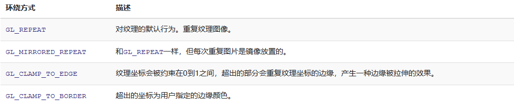

# 纹理

我们已经了解到，我们可以为每个顶点添加颜色来增加图形的细节，从而创建出有趣的图像。但是，如果想让图形看起来更真实，我们就必须有足够多的顶点，从而指定足够多的颜色。这将会产生很多额外开销，因为每个模型都会需求更多的顶点，每个顶点又需求一个颜色属性。

美术和程序员更喜欢使用纹理(Texture)。纹理是一个2D图片（甚至也有1D和3D的纹理），它可以用来添加物体的细节；你可以想象纹理是一张绘有砖块的纸，无缝折叠贴合到你的3D的房子上，这样你的房子看起来就像有砖墙外表了。因为我们可以在一张图片上插入非常多的细节，这样就可以让物体非常精细而不用指定额外的顶点。

下面你会看到之前教程的那个三角形贴上了一张砖墙图片。


为了能够把纹理映射(Map)到三角形上，我们需要指定三角形的每个顶点各自对应纹理的哪个部分。这样每个顶点就会关联着一个纹理坐标(Texture Coordinate)，用来标明该从纹理图像的哪个部分采样（采集片段颜色）。之后在图形的其它片段上进行片段插值(Fragment Interpolation)。

纹理坐标在x和y轴上，范围为0到1之间（注意我们使用的是2D纹理图像）。使用纹理坐标获取纹理颜色叫做采样(Sampling)。纹理坐标起始于(0, 0)，也就是纹理图片的左下角，终始于(1, 1)，即纹理图片的右上角。下面的图片展示了我们是如何把纹理坐标映射到三角形上的。


我们为三角形指定了3个纹理坐标点。如上图所示，我们希望三角形的左下角对应纹理的左下角，因此我们把三角形左下角顶点的纹理坐标设置为(0, 0)；三角形的上顶点对应于图片的上中位置所以我们把它的纹理坐标设置为(0.5, 1.0)；同理右下方的顶点设置为(1, 0)。我们只要给顶点着色器传递这三个纹理坐标就行了，接下来它们会被传片段着色器中，它会为每个片段进行纹理坐标的插值。

纹理坐标看起来就像这样：

```C++
float texCoords[] = {
    0.0f, 0.0f, // 左下角
    1.0f, 0.0f, // 右下角
    0.5f, 1.0f // 上中
};
```

对纹理采样的解释非常宽松，它可以采用几种不同的插值方式。所以我们需要自己告诉OpenGL该怎样对纹理采样。

# 纹理环绕方式

纹理坐标的范围通常是从(0, 0)到(1, 1)，那如果我们把纹理坐标设置在范围之外会发生什么？OpenGL默认的行为是重复这个纹理图像（我们基本上忽略浮点纹理坐标的整数部分），但OpenGL提供了更多的选择：



当纹理坐标超出默认范围时，每个选项都有不同的视觉效果输出。我们来看看这些纹理图像的例子：


前面提到的每个选项都可以使用glTexParameter*函数对单独的一个坐标轴设置（s、t（如果是使用3D纹理那么还有一个r）它们和x、y、z是等价的）：

```C++
glTexParameteri(GL_TEXTURE_2D, GL_TEXTURE_WRAP_S, GL_MIRRORED_REPEAT);
glTexParameteri(GL_TEXTURE_2D, GL_TEXTURE_WRAP_T, GL_MIRRORED_REPEAT);
```

第一个参数指定了纹理目标；我们使用的是2D纹理，因此纹理目标是GL_TEXTURE_2D。第二个参数需要我们指定设置的选项与应用的纹理轴。我们打算配置的是WRAP选项，并且指定S和T轴。最后一个参数需要我们传递一个环绕方式(Wrapping)，在这个例子中OpenGL会给当前激活的纹理设定纹理环绕方式为GL_MIRRORED_REPEAT。

如果我们选择GL_CLAMP_TO_BORDER选项，我们还需要指定一个边缘的颜色。这需要使用glTexParameter函数的fv后缀形式，用GL_TEXTURE_BORDER_COLOR作为它的选项，并且传递一个float数组作为边缘的颜色值：

```C++
float borderColor[] = { 1.0f, 1.0f, 0.0f, 1.0f };
glTexParameterfv(GL_TEXTURE_2D, GL_TEXTURE_BORDER_COLOR, borderColor);
```

# 纹理过滤

纹理坐标不依赖于分辨率(Resolution)，它可以是任意浮点值，所以OpenGL需要知道怎样将纹理像素映射到纹理坐标。当你有一个很大的物体但是纹理的分辨率很低的时候这就变得很重要了。你可能已经猜到了，OpenGL也有对于纹理过滤(Texture Filtering)的选项。纹理过滤有很多个选项，但是现在我们只讨论最重要的两种：GL_NEAREST和GL_LINEAR。

__GL_NEAREST__（也叫邻近过滤，Nearest Neighbor Filtering）是OpenGL默认的纹理过滤方式。当设置为GL_NEAREST的时候，OpenGL会选择中心点最接近纹理坐标的那个像素。下图中你可以看到四个像素，加号代表纹理坐标。左上角那个纹理像素的中心距离纹理坐标最近，所以它会被选择为样本颜色：


__GL_LINEAR__（也叫线性过滤，(Bi)linear Filtering）它会基于纹理坐标附近的纹理像素，计算出一个插值，近似出这些纹理像素之间的颜色。一个纹理像素的中心距离纹理坐标越近，那么这个纹理像素的颜色对最终的样本颜色的贡献越大。下图中你可以看到返回的颜色是邻近像素的混合色：


那么这两种纹理过滤方式有怎样的视觉效果呢？让我们看看在一个很大的物体上应用一张低分辨率的纹理会发生什么吧（纹理被放大了，每个纹理像素都能看到）：

