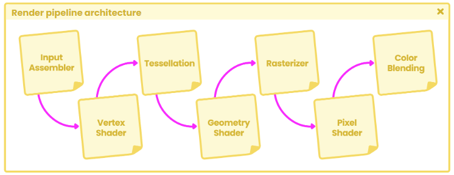
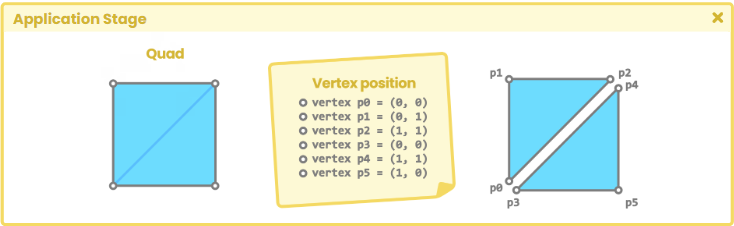
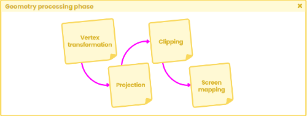

# 渲染管线架构

在当前的Unity版本中，一共有三种类型的渲染管线，分别是 __内置渲染管线__ 、 __通用渲染管线__（在早期版本中被称为轻量渲染管线）和 __高清渲染管线__ 。

所以，什么是渲染管线呢?

管线（流水线）指的是通过执行一系列操作来完成一项更为重要的任务。那么渲染管线具体指的又是什么呢？让我们将它理解为一个模型（例如扩展名为 .fbx 的模型）要渲染到电脑屏幕上所必须经历的一个完整流程。 [OpenGL相关传送门](../../../OpenGL/MyParticles/03_First_Trianggle.md)

## 应用阶段

应用阶段丛CPU开始，负责场景中的一系列操作，例如：

1. 碰撞检测
2. 纹理动画
3. 输入
4. 。。。

应用阶段的功能是读取内存中的存储的模型数据，随后生成图元（如三角形、直线、顶点）。在应用阶段结束时，这些信息都会被发送到几何处理阶段，通过矩阵乘法进行顶点变换。

## 几何阶段

应用阶段结束后，CPU 通过两个主要步骤向 GPU 请求我们在电脑屏幕上看到的图像：

1. 配置渲染状态，即配置几何处理到像素处理的一系列阶段。
2. 在屏幕上绘制图像。

几何阶段主要负责处理模型的顶点，发生在 GPU 上。它分为四个子阶段，分别是：顶点着色、投影、裁剪和屏幕映射。

在应用阶段完成图元装配后，__顶点着色阶段__（顶点着色器阶段）将处理两项主要任务：

1. 计算模型顶点的位置。
2. 将顶点位置转换到不同的坐标空间下，以便投影到计算机屏幕上。

此外，在顶点着色阶段中，我们还可以选择要传递给后续阶段的属性。这意味着在顶点着色阶段中，我们可以加入法线、切线、UV 坐标等属性。