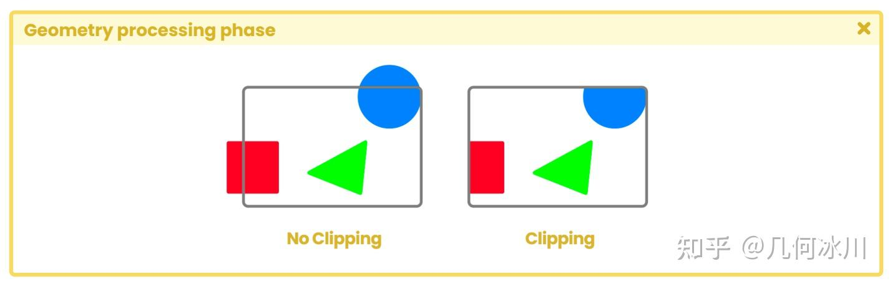
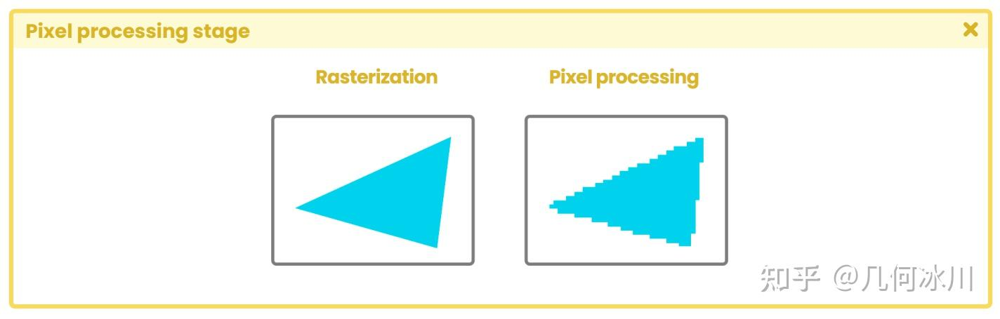

# 渲染管线架构

在当前的Unity版本中，一共有三种类型的渲染管线，分别是 __内置渲染管线__ 、 __通用渲染管线__（在早期版本中被称为轻量渲染管线）和 __高清渲染管线__ 。

所以，什么是渲染管线呢?

管线（流水线）指的是通过执行一系列操作来完成一项更为重要的任务。那么渲染管线具体指的又是什么呢？让我们将它理解为一个模型（例如扩展名为 .fbx 的模型）要渲染到电脑屏幕上所必须经历的一个完整流程。 [OpenGL相关传送门](../../../OpenGL/MyParticles/03_First_Trianggle.md)

## 应用阶段

应用阶段丛CPU开始，负责场景中的一系列操作，例如：

1. 碰撞检测
2. 纹理动画
3. 输入
4. 。。。

应用阶段的功能是读取内存中的存储的模型数据，随后生成图元（如三角形、直线、顶点）。在应用阶段结束时，这些信息都会被发送到几何处理阶段，通过矩阵乘法进行顶点变换。

## 几何阶段

应用阶段结束后，CPU 通过两个主要步骤向 GPU 请求我们在电脑屏幕上看到的图像：

1. 配置渲染状态，即配置几何处理到像素处理的一系列阶段。
2. 在屏幕上绘制图像。

几何阶段主要负责处理模型的顶点，发生在 GPU 上。它分为四个子阶段，分别是：顶点着色、投影、裁剪和屏幕映射。

在应用阶段完成图元装配后，__顶点着色阶段__（顶点着色器阶段）将处理两项主要任务：

1. 计算模型顶点的位置。
2. 将顶点位置转换到不同的坐标空间下，以便投影到计算机屏幕上。

此外，在顶点着色阶段中，我们还可以选择要传递给后续阶段的属性。这意味着在顶点着色阶段中，我们可以加入法线、切线、UV 坐标等属性。

投影和裁剪是应用阶段的一部分，根据场景中摄像机的属性而有所不同。值得注意的是，整个渲染过程只针对位于摄像机视锥体（也被称为观察空间）内的模型。

投影和剪切的结果取决于场景中摄像机是透视相机还是正交相机。为了理解这一过程，我们现在假设场景中有一个球体，这个球体有一半位于摄像机的视锥体之外。对于这个球体而言，只有位于视锥体之内的部分才会被投影、裁剪，最终映射到屏幕上。也就是说，球体在视锥体之外的部分将在渲染过程中被丢弃。

将裁剪好的模型写入内存后，就进入到了屏幕映射阶段。在屏幕映射阶段，我们将场景中的三维物体变换到屏幕坐标系（也被称为窗口坐标系）。

## 光栅化阶段

几何处理的第三个阶段是光栅化。此时，我们的模型已经有了屏幕坐标（二维坐标），现在我们必须在投影区域内找到屏幕上物体所占据的所有像素，这个过程被称为光栅化。光栅化可以看作是场景中的物体与屏幕上的像素之间同步的过程。

对于每个物体，光栅化程序都会执行两个过程：

1. 三角形设置
2. 三角形遍历

三角形设置负责计算屏幕上每个三角形边的像素坐标信息，并将这些数据发送到三角形遍历阶段。三角形遍历会列出每个三角形网格所覆盖的像素，通过这种方式生成一组称为“片元”的序列。需要注意的是，片元并不是真正意义上的像素。

## 像素处理阶段

使用前序阶段得到的数据进行插值，当所有像素都准备好投射到屏幕上后，最后一个阶段——像素处理阶段就准备开始了。片元着色器阶段（也称为像素着色器阶段）负责决定每个像素是否可见，它的基本工作是计算每个像素的最终颜色，然后将其发送到颜色缓冲区。

