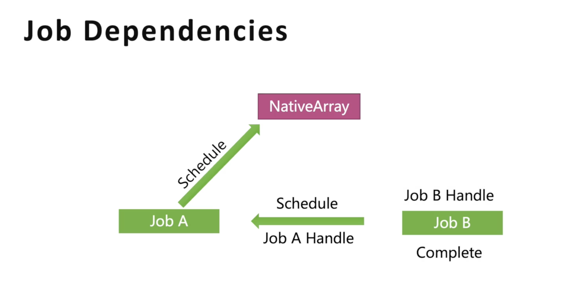

# Job System

## 工作方式

- Run: 主线程上立即执行
- Schedule: 单个工作线程or主线程上，Job顺序执行
- ScheduleParallel: 多个工作线程上同时执行

> 名字带有Parallel的Job仅支持Schedule的调度，但功能是并行的

## Job依赖



可以传入Job A的句柄来一次调度Job

```C#
JobHandle jobAHandle = jobA.Schedule();
JobHandle jobBHandle = jobB.Schedule(jobAHandle);
```

## Job 安全检查

一般用于防止数据冲突访问，可以使用[NativeDisableContainerSafetyRestriction]来规避 or[ReadOnly]

## Entities 创建

略

# System

## SystemGroup

对System进行二次分组，可使用标签[UpdateBefore] [UpdateAfter] [UpdateInGroup]