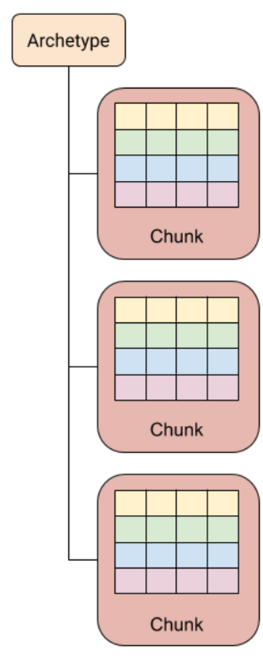

# 实体

一个实体代表了程序中具有独立数据集的离散对象，如角色、视觉效果、UI元素，甚至是像网络事务这样的抽象概念。实体类似于非托管的轻量级游戏对象（GameObject），它代表程序中的特定元素。此外，实体充当将各个唯一组件关联在一起的 ID，而不是包含任何代码或充当其关联组件的容器。

实体的集合存储在一个名为`World`的空间中，其中`World`的`EntityManager`负责管理该世界中的所有实体。EntityManager 包含了一些方法，您可以使用这些方法在该世界内创建、销毁和修改实体。

> NOTE
> 
> 当您创建或销毁一个实体时，这会产生结构性变化，从而影响应用程序的性能。

实体本身没有类型，但您可以根据关联的组件类型对实体进行分类。`EntityManager`负责跟踪现有实体上的组件的独特组合。这些独特的组合被称为原型（archetypes）。

# 组件

在实体组件系统（ECS）架构中，组件包含系统可读写的实体数据。

使用`IComponentData`接口（不包含任何方法）来将结构体标记为组件类型。这种组件类型只能包含非托管数据，它们可以包含方法，但最佳实践是仅作为纯数据。如果您想创建一个托管组件，则将其定义为类。

实体组件的唯一集合称为原型（archetype）。ECS 架构将组件数据按原型存储在称为块（chunks）的 16KB 内存块中。

# 系统

系统提供将组件数据从当前状态转换为下一个状态的逻辑。例如，一个系统可能会通过将所有移动实体的速度乘以上次更新以来的时间间隔来更新它们的位置。

系统在主线程上每帧运行一次。系统被组织成一个层次结构的系统组，您可以使用这些系统组来组织系统更新的顺序。

您可以在 Entities 中创建托管或非托管系统。要定义托管系统，请创建一个继承自 SystemBase 的类。要定义非托管系统，请创建一个继承自 ISystem 的结构体。

ISystem 和 SystemBase 都有三个可覆写的方法：OnUpdate、OnCreate 和 OnDestroy。系统的 OnUpdate 方法每帧执行一次。

一个系统只能处理一个世界中的实体，因此系统与特定世界关联。您可以使用 World 属性返回系统所附加到的世界。

默认情况下，一个自动引导过程会创建每个系统和系统组的实例。引导过程创建了一个具有三个系统组的默认世界：InitializationSystemGroup、SimulationSystemGroup 和 PresentationSystemGroup。默认情况下，一个系统的实例被添加到 SimulationSystemGroup。您可以使用 [UpdateInGroup] 属性来覆盖此行为。

要禁用自动引导过程，请使用脚本定义 #UNITY_DISABLE_AUTOMATIC_SYSTEM_BOOTSTRAP。

# 世界

World 是一个实体的集合。实体的 ID 号在其所属的世界中是唯一的。一个世界拥有一个 EntityManager 结构体，您可以使用它在世界内创建、销毁和修改实体。

一个世界拥有一组系统，这些系统通常只访问同一世界内的实体。此外，世界中具有相同组件类型集合的实体会一起存储在一个原型（archetype）中，这决定了程序中的组件如何在内存中组织。

# 原型

原型（archetype）是一个唯一标识符，用于标识具有相同独特组件类型组合的世界中所有实体。例如，具有组件类型 A 和 B 的世界中的所有实体共享一个原型。具有组件类型 A、B 和 C 的所有实体共享另一个不同的原型，而具有组件类型 A 和 Z 的所有实体则共享又一个不同的原型。

当您向实体添加或删除组件类型时，世界的 EntityManager 会将实体移动到适当的原型。例如，如果一个实体具有组件类型 A、B 和 C，而您移除了其 B 组件，则 EntityManager 会将该实体移动到具有组件类型 A 和 C 的原型。如果不存在这样的原型，EntityManager 就会创建它。

> 注意！
>
> 频繁移动实体会消耗大量资源，并降低应用程序的性能。

基于原型的实体组织方式意味着通过组件类型查询实体是非常高效的。例如，如果您想查找具有组件类型 A 和 B 的所有实体，您可以找到具有这些组件类型的所有原型，这比逐个扫描所有实体的性能更好。一个世界中现有的原型集合往往在程序生命周期的早期就趋于稳定，因此您可以缓存查询以获得更快的性能。

## 原型块(Chunk)

具有相同原型的所有实体和组件都存储在称为块（chunks）的统一内存块中。每个块包含 16KiB，它们可以存储的实体数量取决于块的原型中的组件数量和大小。EntityManager 根据需要创建和销毁块。

一个块包含一个用于每种组件类型的数组，以及一个额外的数组用于存储实体 ID。例如，在具有组件类型 A 和 B 的原型中，每个块都有三个数组：一个用于存储 A 组件值的数组，一个用于存储 B 组件值的数组，以及一个用于存储实体 ID 的数组。

块的数组紧凑排列：块的第一个实体存储在这些数组的索引 0 处，块的第二个实体存储在索引 1 处，后续实体依次存储在连续索引中。当向块中添加新实体时，它将存储在第一个可用索引处。当从块中移除实体（因为正在销毁或者正在移动到另一个原型）时，块的最后一个实体会被移动以填补空缺。

当向原型中添加实体时，如果原型现有的块都已满，EntityManager 则会创建一个新的块。当从块中移除最后一个实体时，EntityManager 销毁这个块。

