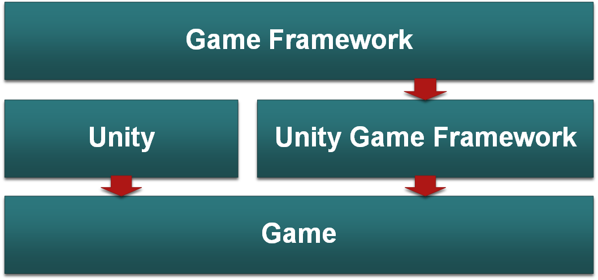

# 总览

[中文官网](https://gameframework.cn/)

[框架Core部分地址](https://github.com/EllanJiang/GameFramework)

[花桑大佬解析](https://zhuanlan.zhihu.com/p/426133897)

GameFramework算是一个比较老的框架了，非常经典，但是遗憾的是其没有太多详细的教程，连作者都没更完（好像是后来卖钱是完整的），因此这里一边学习，一遍剖析该框架的详细制作思路，后文都称作GF。

# 整体架构

整体架子的设计，秉承了能脱离引擎则脱离的概念，[GameFramework部分](https://github.com/EllanJiang/GameFramework)被封成dll，Unity GameFramework部分使用dll和Unity引擎部分共同制作游戏部分。

### GF层

- 包含框架中各个模块的具体实现，不依赖于引擎
- 各个模块若有需要引擎传递的参数，可通过UGF层的Component在初始化时传入
- 若需要调用依赖于引擎实现的接口，可定义对应的IHelper接口，并在UGF层实现接口，GF层只调用，不关心具体实现

### UGF层

- 实现框架中需要依赖Unity的逻辑，把框架与引擎解耦
- 作为Game层与GF层之间的桥梁
- 实例化并初始化框架各个模块
- 借助Unity的Editor扩展，实现各个模块参数的可视化配置

### Game层

直接做逻辑

## 启动
1. GF中每个模块都有一个对应的Component（继承自Monobehaviour），并挂在各自对应的GameObject上，放在启动场景中，当运行游戏时，Unity便会调用各个Component的Awake方法。
2. 在GameFrameworkComponent（UGF中所有Component的基类）的Awake方法中，会调用GameEntry.RegisterComponent把Component注册到GameEntry中，以方便在其他地方通过GameEntry来访问任意Component。
3. 因为Component是继承自Monobehaviour并被直接挂在场景中的GameObject上，引擎会执行Component的实例化，而GF层中的各个模块（Module）是普通C#类，需要我们自己去实例化，GF便是在Component的Awake中去实例化各个模块类。（Resource模块比较特殊，在Start实例化）。
4. 各个Component的Start方法被调用，考虑到模块可能需要依赖其他模块，所以在Awake过后，各个Component注册到GameEntry中后（这样才能获取到其他模块的引用），再在Start阶段初始化各个模块。
5. 根据Inspector面板配置和Unity API的参数，初始化各个模块，并实例化Component所需要的GameObject。
6. 实例化模块所需要的Helper，并以接口形式传递给对应模块。
7. Procedure是框架中管理整个游戏流程的模块，Procedure的Component中的Start方法以协程方式启动，协程等待了一帧，这一帧猜测是等待步骤5中实例化出来的GameObject对象完成初始化，避免游戏启动逻辑与这些GameObject的初始化有依赖时产生时序问题。
8. 游戏启动第二帧，Procedure模块启动我们指定的入口流程。
9. 执行ProcedureLaunch流程的OnEnter方法，游戏的第一句具体逻辑，在这正式被调用。

## GFMoudle实例化
GameFrameworkModule（GF层中各个模块的基类）采用惰性实例化，UGF的Component通过调用GameFrameworkModule.GetModule来获取模块对象，在GetModule时，GameFrameworkEntry会先检测内部有没有这个模块对象，没有时再调用内部的CreateModule来实例化该模块。

## Tick概念
Tick一般指最小单元，貌似动作游戏格斗游戏里逻辑表现分离用的比较多，因为各个Monobehaviour之间不能很好地控制顺序问题，GF通过指定的一个Monobehaviour中的Update方法去驱动所有模块的Update，各自模块的Update顺序由各自模块定义的优先级决定，这样只要在框架管理下的模块，都能做到执行顺序可控。

# 详细模块目录

## Unity Game Framework

### [Base](2.Base.md)