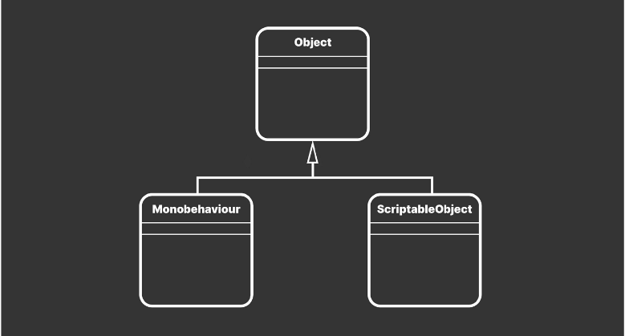
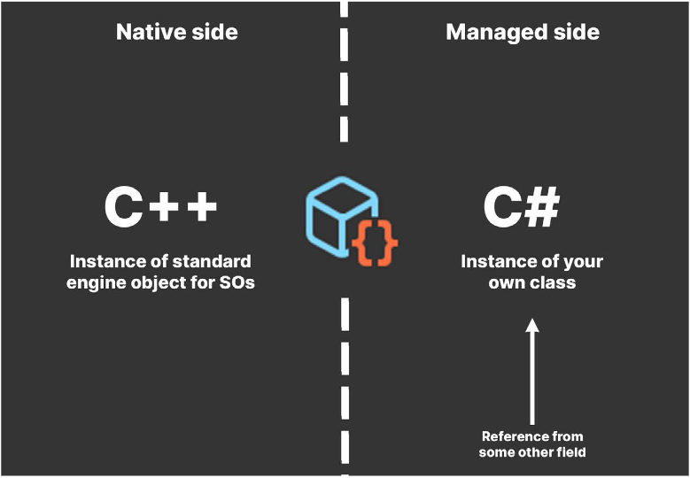
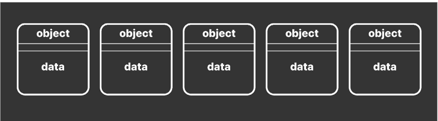
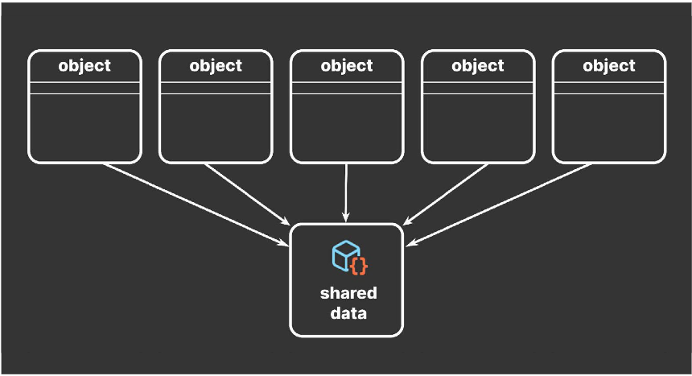
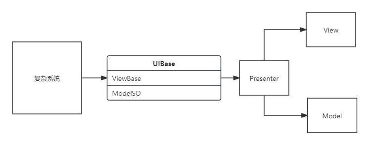
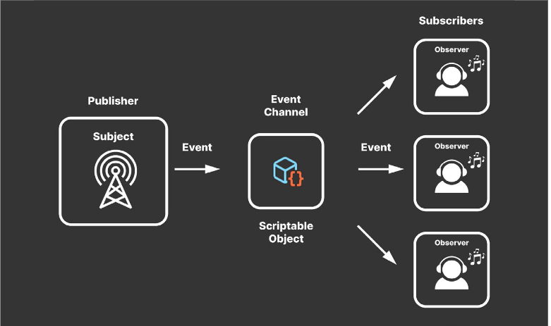

# SO基础

## ScriptableObject vs MonoBehaviour



SO:
- 并不完全依赖于Unity的内部回调函数，只包含：Awake，OnEnable，OnDisable，OnDestroy，OnValidate，Reset。
- 不依赖于GameObject，可以直接当做资产文件加载使用，运行时内存占用率低。
- 在编辑器下，修改的SO内容不会被自动重置。而打出项目后，SO中的内容不会保存。

## 创建与释放



# 利用SO

## 数据容器

以MonoBehaviour存储序列化数据的不便之处：

1. `耦合和职责分离`: 将游戏逻辑和数据紧密耦合在MonoBehaviour中会使得代码组织混乱，违反了单一职责原则。这降低了可维护性和可扩展性。理想的做法是分离数据和行为，使代码易于管理。
2. `内存开销`: MonoBehaviour脚本需要附加到GameObject上以便于运行。如果只是为了存储数据而创建大量的GameObject和脚本实例，那么这将带来不必要的内存和性能开销。
3. 场景依赖: MonoBehaviour脚本通常与场景中的GameObject关联，这意味着当场景未加载时，其中的数据不可用。对于需要跨场景持久化的数据，使用MonoBehaviour来序列化不太适合。
4. 版本控制复杂性: 如果一个项目团队成员修改了包含大量数据的MonoBehaviour脚本，那么可能会导致版本控制冲突，特别是当这些数据频繁改变时。
5. `编辑器性能`: 在Unity编辑器中处理拥有大量序列化数据的MonoBehaviour可能导致性能问题，编辑器可能会变慢，特别是在检视面板中显示和编辑这些数据时。
6. `数据共享和重用`: 使用MonoBehaviour难以共享数据，每个脚本的实例都有自己的数据副本。如果多个对象需要访问或修改相同的数据，则可能需要复杂的同步机制。
7. 不支持多线程: Unity的主线程负责所有的MonoBehaviour方法调用（例如Update, Start, 等）。如果数据被序列化在MonoBehaviour中，它们就不能轻易地在多线程环境中使用，这限制了某些优化方式。
8. 测试难度: 由于MonoBehaviour的实例是与Unity引擎环境紧密绑定的，编写单元测试变得更加困难。
9. 资源管理: 使用MonoBehaviour进行数据序列化会使资源管理变得复杂，尤其是当涉及到动态加载和卸载资源时。

## 减少重复数据的维护

享元模式





## 小框架利用：SO + UniRx + MVP



解决问题：
1. UI内部通讯
2. 不同界面间数据共享
3. 数据逻辑解耦

## 信号通道



```C#
public abstract class GenericEventChannelSO<T> : DescriptionSO
    {
        public UnityAction<T> OnEventRaised;
 
        public void RaiseEvent(T parameter)
        {

            if (OnEventRaised == null)
                return;

            OnEventRaised.Invoke(parameter);

        }
    }
```

```C#
[CreateAssetMenu(menuName = "Events/Int EventChannel", fileName = "IntEventChannel")]
    public class IntEventChannelSO : GenericEventChannelSO<int>
    {
    }
```

## 命令模式

```C#

CommandQueue.Init()
    .AddCommand(new Command(...))
    .AddCommand(new Command(...))
    .AddCommand(new Command(...))
    .StartQueue()

```

`Command`构造函数可以添加同步和异步方法，一个`Command`周期内，先执行同步方法，再执行异步方法，同时可以传入一个`Fun<bool>`返回为true，用于作为一个流程的结束。